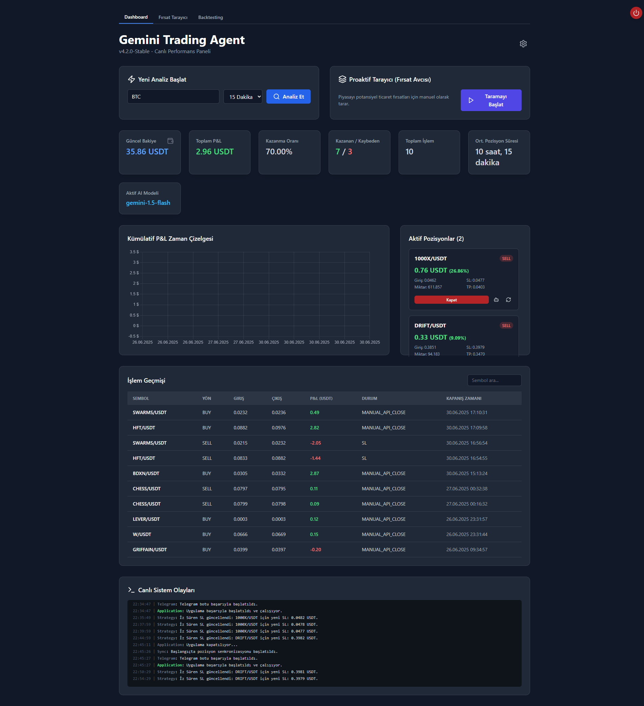
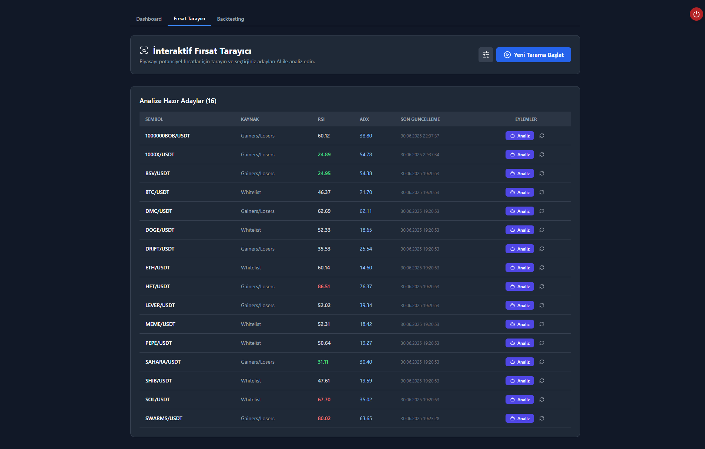

<div align="center">

# ♊ Gemini Trading Agent

**AI Destekli, Web Arayüzlü, Self-Hosted Kripto Ticaret Botu**

[GitHub Deposu](https://github.com/MembaCo/Gemini-Agent-Web) | [Kurulum](#-kurulum-ve-çalıştırma) | [Özellikler](#-temel-özellikler)

[](https://opensource.org/licenses/MIT)
[](#-katkıda-bulunma)
[](https://www.python.org)
[](https://react.dev/)

</div>

**Gemini Trading Agent**, Google'ın güçlü Gemini AI modellerini kullanarak kripto para piyasalarında (Vadeli & Spot) gelişmiş analizler yapan ve işlem gerçekleştiren, tamamen kendi sunucunuzda çalıştırabileceğiniz modern bir bottur.

Kullanıcı dostu ve modern web arayüzü sayesinde tüm operasyonlarınızı kolayca yönetebilir, performansınızı anlık takip edebilir, stratejileri geriye dönük test edebilir ve bot ayarlarını hızlıca güncelleyebilirsiniz.

<div align="center">

>
>
>

</div>

## Neden Gemini Trading Agent?

Bu proje, aşağıdaki hedeflere sahip kullanıcılar için tasarlanmıştır:

- 🏦 **Otomasyon:** Ticaret stratejilerini 7/24 çalışan bir sistemle otomatize etmek.
- 🧠 **Yapay Zeka Avantajı:** Google Gemini'ın gelişmiş analiz yetenekleriyle piyasada avantaj sağlamak.
- 🎯 **Veriye Dayalı Kararlar:** Duygusal kararlar yerine, teknik göstergeler ve AI analiziyle işlem yapmak.
- 👻 **Veri Mahremiyeti:** Tüm strateji, ayar ve işlem verilerini kendi kontrolündeki bir sunucuda (self-hosted) tutmak.
- ⚙️ **Esnek Kontrol:** Web arayüzü üzerinden tüm risk yönetimi ve strateji parametrelerini anlık olarak değiştirebilmek.
- 📈 **Strateji Geliştirme:** Backtest motoru ile farklı fikirleri geçmiş veriler üzerinde risksiz bir şekilde test etmek.

## ✨ Temel Özellikler

- ✅ **Web Tabanlı Kontrol Paneli:** React ile geliştirilmiş hızlı ve duyarlı arayüz ile anlık P&L takibi, interaktif grafikler ve canlı olay akışı.
- ✅ **Gelişmiş Risk Yönetimi:**
    - **Dinamik Pozisyon Boyutlandırma:** Her işlemde sermayenin belirli bir yüzdesini riske atar.
    - **Akıllı Zarar Azaltma (Bailout Exit):** Zarardaki pozisyonları, dipten toparlanma anlarında yapay zeka onayı ile kapatarak kayıpları minimize eder.
    - **İz Süren Zarar Durdur (Trailing Stop-Loss)** ve **Kısmi Kâr Alma (Partial TP)**.
- ✅ **Yapay Zeka Destekli Analiz:**
    - **Google Gemini 1.5 Flash/Pro** ile derinlemesine piyasa analizleri.
    - **Dominant Sinyal Analizi:** Çoklu zaman dilimli analizlerde, trendi güçlü olan periyodu AI'a bildirerek daha tutarlı kararlar alınmasını sağlar.
- ✅ **Akıllı Fırsat Tarayıcı:**
    - Potansiyel işlem fırsatlarını **volatilite (ATR)** ve **hacim** gibi gelişmiş filtrelerle ön elemeye tabi tutar.
    - Sadece umut vadeden adayları AI analizine göndererek maliyetleri düşürür.
- ✅ **Strateji Backtest Motoru:** Farklı piyasa koşullarında strateji performansını ölçmek için kullanılır.
- ✅ **Dinamik ve Veritabanı Tabanlı Ayarlar:** Tüm bot ayarları arayüzden anlık olarak güncellenebilir ve kalıcı olarak saklanır.
- ✅ **Telegram Entegrasyonu:** Anlık bildirimler ve temel bot komutları için Telegram desteği.

## 🛠️ Teknoloji Yığını

| Katman | Teknoloji |
| :--- | :--- |
| **Backend** | Python, FastAPI, LangChain, CCXT, Pandas-TA, APScheduler, asyncio |
| **Frontend** | React, Vite, Tailwind CSS, Chart.js, Lightweight Charts |
| **Veritabanı** | SQLite |
| **Dağıtım** | Docker, Docker Compose |

## 🚀 Kurulum ve Çalıştırma

**Başlamak için bilgisayarınızda [Git](https://git-scm.com/) ve [Docker Desktop](https://www.docker.com/products/docker-desktop/) kurulu olmalıdır.**

### 1. Projeyi Klonlayın

```bash
git clone [https://github.com/MembaCo/Gemini-Agent-Web.git](https://github.com/MembaCo/Gemini-Agent-Web.git)
cd Gemini-Agent-Web

### 2. Ortam Değişkenlerini Ayarlayın
backend/ dizininde .env.example dosyasını kopyalayarak yeni bir .env dosyası oluşturun:

```bash
cp backend/.env.example backend/.env
Oluşturduğunuz .env dosyasını bir metin editörü ile açarak ZORUNLU alanları doldurun:

```bash
# ZORUNLU AYARLAR
BINANCE_API_KEY="YOUR_BINANCE_API_KEY"
BINANCE_SECRET_KEY="YOUR_BINANCE_SECRET_KEY"
GOOGLE_API_KEY="YOUR_GOOGLE_AI_API_KEY"
ADMIN_USERNAME="admin"
ADMIN_PASSWORD_HASH="$2b$12$....YOUR_GENERATED_PASSWORD_HASH_HERE...."
SECRET_KEY="your_super_secret_key_for_jwt_tokens"

# İSTEĞE BAĞLI AYARLAR
TELEGRAM_ENABLED=True
TELEGRAM_BOT_TOKEN="YOUR_TELEGRAM_BOT_TOKEN"
TELEGRAM_CHAT_ID="YOUR_TELEGRAM_CHAT_ID"
USE_TESTNET=False


**Önemli: Güvenli bir şifre hash'i oluşturmak için projenin ana dizinindeyken aşağıdaki komutu çalıştırın ve çıktıyı .env dosyasına yapıştırın:**

```bash
python3 backend/hash_password.py 'sizin_guvenli_sifreniz'
3. Uygulamayı Başlatın
Projenin ana dizinindeyken aşağıdaki komutu çalıştırın:

```bash
docker-compose up --build
Bu komut, hem backend hem de frontend servislerini kurup başlatacaktır.


## 🖥️ Kullanım
### Uygulama başarıyla başladıktan sonra tarayıcınızdan http://localhost:8080 adresine gidin.

.env dosyasında belirlediğiniz kullanıcı adı ve şifre ile giriş yapın.

Dashboard üzerinden botu izleyin, manuel analiz yapın veya backtest işlemlerini başlatın.

Tüm bot ayarlarını sağ üstteki Ayarlar (⚙️) ikonundan anlık olarak değiştirebilirsiniz.

```bash
📂 Proje Yapısı
Gemini-Agent-Web/
├── backend/        # Python FastAPI sunucusu ve bot mantığı
│   ├── api/        # API endpoint'leri
│   ├── core/       # Agent, strateji, pozisyon yönetimi
│   ├── tools/      # Borsa bağlantısı, gösterge hesaplama vb.
│   ├── database/   # Veritabanı fonksiyonları
│   └── .env        # Ortam değişkenleri dosyası
├── frontend/       # React tabanlı web arayüzü
├── data/           # Kalıcı veriler (ör: trades.db SQLite)
├── docker-compose.yml
└── README.md

## ⚠️ Risk Uyarısı
### Uyarı: Bu yazılım finansal piyasalarda işlem yapmak için geliştirilmiştir. Kripto para ticareti yüksek risk içerir ve sermayenizin bir kısmını veya tamamını kaybetmenize neden olabilir. Yazılım tarafından yapılan analizler veya işlemler yatırım tavsiyesi değildir. Tüm sorumluluk kullanıcıya aittir. Canlı işlem açmadan önce riskleri anladığınızdan emin olun.

## 🤝 Katkıda Bulunma
### Katkı yapmak ister misiniz?
### Bir issue açabilir veya pull request gönderebilirsiniz. Her türlü öneri ve geliştirmeye açığız!

## 📄 Lisans
### Bu proje MIT Lisansı ile lisanslanmıştır. Detaylar için LICENSE dosyasına bakın.